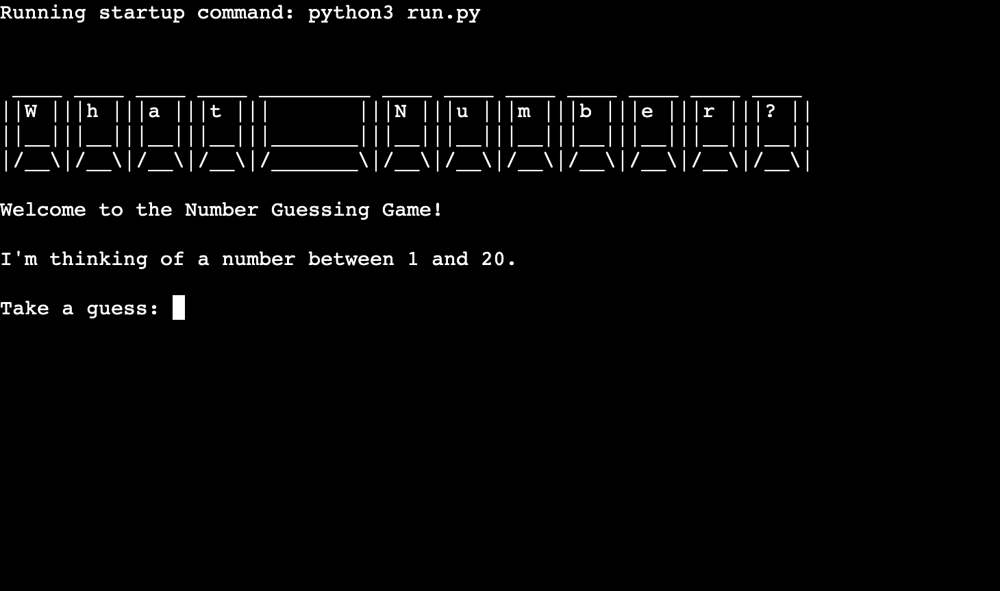
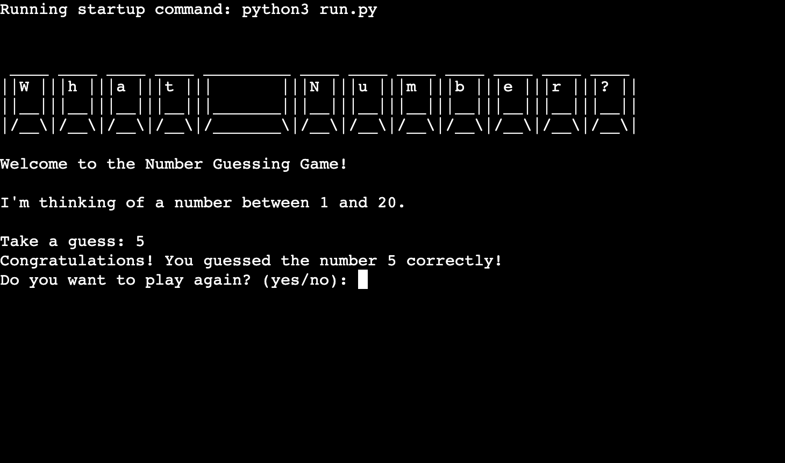
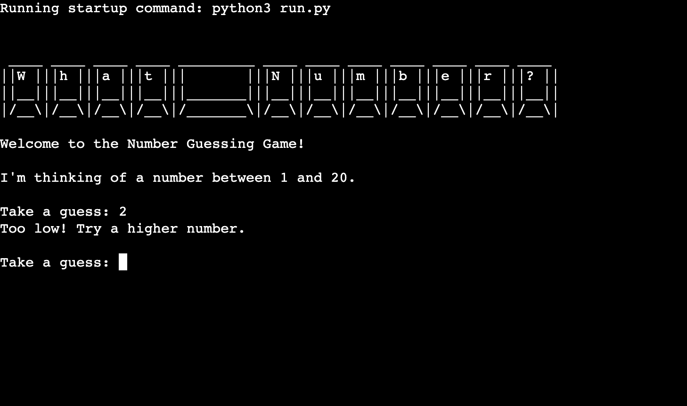
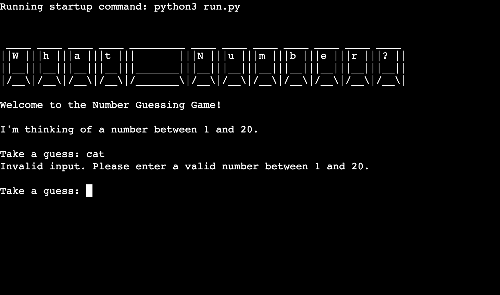
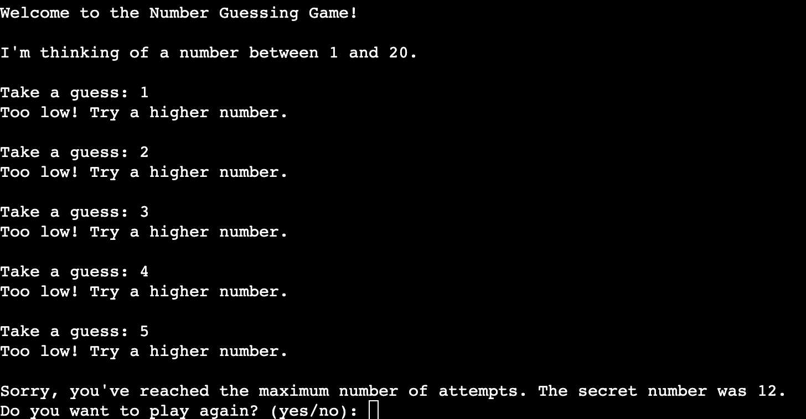
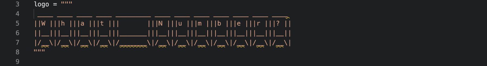

# What Number?
> [Click here to view the live website on GitHub Pages](https://what-number-c26ae6113643.herokuapp.com/) Please note: To open any links in this document in a new browser tab, please press `Cmd ⌘ + Click` (Mac) or `CTRL + Click` (Windows/Linux)

- The Number Guessing Game is a simple Python text-based game where the player tries to guess a secret number randomly generated between `1` and `20`. The game starts by welcoming the player and informing them of the number range. The player has a `maximum of 5 attempts` to guess the secret number correctly. After each guess, the game provides feedback, indicating whether the guess is `too high` or `too low`.

- If the player correctly guesses the secret number within the allowed attempts, the game congratulates them and asks if they want to play again. If the player exhausts all attempts without guessing the correct number, the game informs them of the secret number and asks if they want to play again.

- The player can choose to continue playing the game or exit by entering `yes` or `no` when prompted to play again. The game loop repeats as long as the player wants to continue playing.

- The game offers a fun and interactive experience for players, challenging their guessing skills while providing opportunities for improvement in subsequent attempts.

## How to play
To play the number guessing game, follow these steps:

- Run the Python script that contains the game code. You can execute the script using a Python interpreter on your computer.

- The game will start with a cool ASCII art logo displaying the title `What Number?`.

- The game will welcome you to the Number Guessing Game and inform you that it has `picked a random number between 1 and 20`.

- You need to guess the secret number chosen by the game.

- Enter your guess as an integer when prompted. Make sure your guess is a number between `1` and `20`.

- The game will inform you if your guess is correct or not. If it's correct, the game will congratulate you, and the round will end.

- If your guess is incorrect, the game will provide feedback, telling you if the secret number is `higher` or `lower` than your guess.

- You have a `total of 5 attempts` to guess the correct number. If you don't guess correctly within these attempts, the round ends.

- After each round, the game will ask you if you want to play again. To play another round, enter `yes` when prompted. If you don't want to play again, enter anything other than `yes`, and the game will end.

- The game will keep running as long as you choose to play again. You can keep playing and trying to guess the secret number in each round.

- Remember, the game is all about trying to guess the secret number within a limited number of attempts. Use the feedback provided by the game to make better guesses in each round.

- Have fun playing the Number Guessing Game and see if you can guess the secret number correctly!

## Existing Features
### Terminal Game Start `Heroku`
- Here the terminal displays the `Running statup command: python3 run.py`
- Game `ASCII logo` introducing you to the game `Welcome to the Number Guessing Game!`
- Propting you to enter a value between 1 and 20 `I'm thinking of a number between 1 and 20.` following the `Take a guess: ` value input.

### Correct Answer Guessed `Heroku`
- Here the terminal displays a value fo `5` entered into the `Take a guess: ` value input, with a following message of `Congratulations! You guessed the number 5 correctly!` as the secret number was the value of `5`.
- Displaying another value input to restart the game `Do you want to play again? (yes/no): `.

### Answer Guessed too Low `Heroku`
- Here the terminal displays a value fo `2` entered into the `Take a guess: ` value input, with a following message of `Too low! Try a higher number.` as the secret number is higher than the value entered.
- Prompting the user to enter another value `Take a guess: `.

### Answer Guessed too High `Heroku`
- Here the terminal displays a value fo `17` entered into the `Take a guess: ` value input, with a following message of `Too high! Try a lower number.` as the secret number is lower than the value entered.
- Prompting the user to enter another value `Take a guess: `.

### Incorrect Value Entered `Heroku`
- Here the terminal displays an error message `Invalid input. Please enter a valid number between 1 and 20.` stating that the value entered is not a valid input.
- Prompting the user to enter another value between `1` and `20`.

### Maximum Attempts `Heroku`
- Here the terminal displays 5 incorrect entries bringing the current game to a close with the following message `Sorry, you've reached the maximum number of attempts.`.
- Providing the user with the correct answer: `The secret number was 12`.
- Displaying another value input to restart the game `Do you want to play again? (yes/no): `.

### ASCII Art Logo `run.py file`
- The game starts with an ASCII art logo displaying the title `What Number?`.
- The logo is visually appealing and adds a nice touch to the game.

### generate_secret_number( ) Function `run.py file`
- This function generates a random secret number between 1 and 20 (inclusive) using the `random.randint()` function from the `random` module library.

- The generated secret number will be the number that the player needs to guess.
-function.png)

### get_player_guess( ) Function `run.py file`
- This function prompts the player to enter their guess for the secret number.
- It uses a `while loop` to repeatedly ask for input until the player enters a valid integer between `1` and `20`.
- If the player enters an invalid input (e.g., a non-numeric value or a number outside the valid range), an error message is displayed, and the player is prompted to try again.
-function.png)

### check_guess( ) Function `run.py file`
- This function compares the player's guess with the secret number and provides feedback to the player.
- If the guess is correct (equal to the secret number), the function prints a congratulatory message.
- If the guess is `too low` or `too high`, the function informs the player to try a higher or lower number, respectively.
-function.png)

### play_game( ) Function `run.py file`
- The main game loop is implemented in the `play_game()` function.
- It contains the logic for running the game from start to finish and handling multiple rounds if the player chooses to play again.
- The `loop` starts with the ASCII art logo and a welcome message.
- It generates a new secret number for each round and initialises the attempts counter.
- Inside the `loop`, the player is prompted to enter a guess, and the game checks if it's correct or not.
- If the player guesses correctly, the game congratulates them, and the `loop` ends for that round.
- If the player exhausts all attempts without guessing correctly, the game informs the player about the secret number.
- After each round, the player is asked if they want to play again. If the player enters `yes`, a new round starts. Otherwise, the `loop` exits, and the game ends.
-function.png)
- the `if __name__ == "__main__":` block ensures that the `play_game()` function is only called and the game is started when the script is run directly as the main program.

## Data Model
The data model for this number guessing game consists of the secret number, the player's guesses, attempts counter, feedback messages, and the play again option. It manages the game's flow and user interactions through these simple data elements.

## Testing
I have manually tested this project by doing the following:
- Passed the code through a PEP8 linter and confirmed there are no problems.
- Given invalid inputs: strings when numbers are expected, out of bounds inputs, same input twice.
- Tested in my local terminal and the Code Institute Heroku terminal.

### Bugs
Solved Bugs:
- When looking for ASCII Art for the title `What Number?`, originally I used the font name `Big Money-ne`, however; the width of the text exceeded constraints of the maximum column width of `80pts`. This was changed to the font name `Small Keyboard` which did not exceed the constraints and I found more relevant to the style of game.

Remaining Bugs:
- No bugs remaining

### Validator Testing
- PEP8
    - No errors were returned from PEP8online.com

## Deployment
> [Click here to view the live website on GitHub Pages](https://what-number-c26ae6113643.herokuapp.com/) Please note: To open any links in this document in a new browser tab, please press `Cmd ⌘ + Click` (Mac) or `CTRL + Click` (Windows/Linux)
This project was deployed using the Code Institute mock terminal for Heroku.
Deployment Steps:
- Fork or clone this repository.
- Create a new Heroku app.
- Set the build-packs to `heroku/python` and `heroku/node.js` in that order.
- Link the Heroku app to the repository.
- Click on deploy.

## Credits
### Websites:
- [patorjk](https://patorjk.com/software/taag/#p=testall&f=Small&t=What%20Number%3F%0A)
    - Font name: Small Keyboard